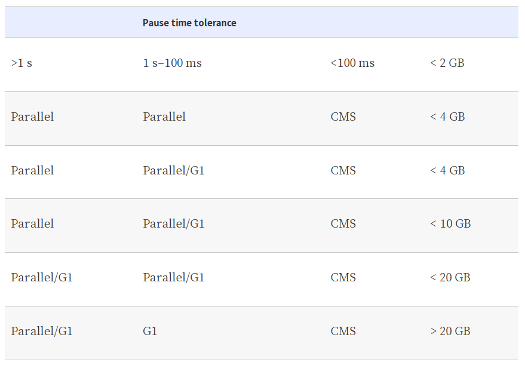
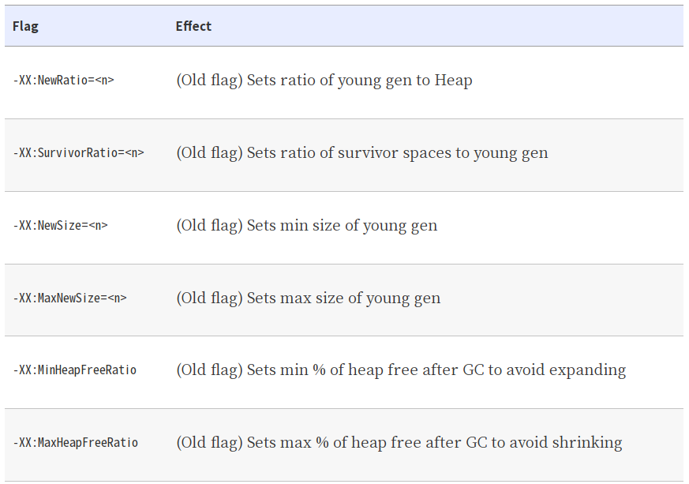

<!--
headingDivider: 2
-->


<!-- _class: title -->

# Optimizing Java

Chapter 8. GC Logging, Monitoring, Tuning, and Tools

_2021-07-28_
_Kohei Sakai_

## ToC

この章で理解できること

1. GCのロギングとモニタリング
2. そのためのツール

## GCロギングの概要

パフォーマンスの問題の「コールドケース」分析に利用。
GCロギングは no real observable overhead なので、重要なJVMプロセスでは常にオンにすることが必要。


### 必須のGCフラグ (Java 8)

```
-Xloggc:gc.log
-XX:+PrintGCDetails
-XX:+PrintTenuringDistribution // Adds extra GC event detail that is vital for tooling
-XX:+PrintGCTimeStamps // Prints the time (in secs since VM start) at which GC events occurred
-XX:+PrintGCDateStamps // Prints the wallclock time at which GC events occurred
```

Java 9以降の場合、[表2-1 従来のガーベジ・コレクションのロギング・フラグとXlog構成とのマッピング](https://docs.oracle.com/javase/jp/9/tools/java.htm) を見ると良さそう。

```
-Xlog:gc:gc.log -Xlog:gc\* -Xlog:age\*=debug
```

## ログローテーション

```
-XX:+UseGCLogFileRotation     // ログファイルをローテーション
-XX:+NumberOfGCLogFiles=<n>  // 保持するログファイル数
-XX:+GCLogFileSize=<size>    // ローテーション前の最大サイズ
```

Java 9以降では、Xlogで設定を行うらしい。
```
-Xlog::::filecount=file count filesize=file size with optional K, M or G suffix
```

## GCログとJMX

Java Management eXtensions（JMX）を使っても、JVMのデータを収集できる。ただし、基本的に **GC解析にはGCログの方が優れている** 。

- GCログデータは実際のgcイベント駆動だけど、 JMXソースデータはサンプリング
- GCログデータはキャプチャの影響が非常に少ないけど、JMXには暗黙的なプロキシとリモートメソッド呼び出し(RMI)のコストがある
- GCログデータにはJavaのメモリ管理に関連するパフォーマンスデータの50以上のデータがあるけど、JMXには10未満しかない

jClarity Censum などのログ解析ツールは、GCログをストリーミングして解析できる。
JMXはBeanにアクセスしたり、他の有用性もある。

## JMXの欠点

クライアントからは、GCがいつ実行されるかを正確に知る方法がない。


また、JMXConnector はRMIに依存しているので、RMI接続に関連した欠点がある。
- RMIコネクションは接続をcloseするのはすぐできるが、teardownはfinalizeに依存している
- JMX接続のライフサイクル的に、RMIオブジェクトはtenured領域にいき、full GC以外で回収されない
    - finalizeの影響については [Avoid Finalization](https://learning.oreilly.com/library/view/optimizing-java/9781492039259/ch11.html#pracjavaperf-CHP-11-SECT-6) を参照
- defaultでは、RMIを使用するアプリケーションは1時間に1回 full GCがトリガされる

## GC log dataの利点

GCロギングはnon-blockingの書き込みをHotSpot JVMから行う。
アプリへのパフォーマンス影響はほぼないので、すべてのプロダクションアプリでオンにする必要がある。

GCログの生データは色々な種類の分析を行うことができるので、GCコストに関する洞察を得ることが可能。その結果、どのチューニングが良い結果を生む可能性が高いかを知ることができる。

## Log Parsing Tools

GCログメッセージは標準フォーマットがなく、HotSpot GC開発チームの気まぐれに任されている！
マイナーリリース間でさえ変更される可能性がある。パースを自前でやるべきではないので、世のツールを使ったほうが良い。

- [GCViewer](https://github.com/chewiebug/GCViewer)
- [GCeasy](https://gceasy.io/diamondgc-report.jsp?oTxnId_value=a70eaf5a-8e59-4ad1-8462-b5245aa49a4f)
- [sematext](https://sematext.com/)(商用ツール)

## 基本的なGCチューニング

GCチューニングに関する事実として以下を覚えておくと便利。
- パフォーマンス問題の原因としてGCを排除・確認するのは安価
- UATでGCフラグをオンにするのは安価
- メモリやプロファイラを実行するのは安価ではない

4つの主な測定対象がある。
- **allocation**
- pause sensitivity
- throughput behavior
- object lifetime


---

basic heap sizing flags:

```
-Xms<size>                  // Sets the minimum size reserved for the heap
-Xmx<size>                  // Sets the maximum size reserved for the heap
-XX:MaxPermSize=<size>      // Sets the maximum size permitted for PermGen (Java 7)
-XX:MaxMetaspaceSize=<size> // Sets the maximum size permitted for Metaspace (Java 8)
```

---

[_Basic Detection Strategies_](https://learning.oreilly.com/library/view/optimizing-java/9781492039259/ch03.html#pracjavaperf-CHP-3-SECT-6)で説明したとおり、以下の条件の場合はGCをチューニングする必要がある。
* CPU資料率が100%近い
* この時間の大部分(90%以上)がUser spaceで費やされている
* GCログがアクティビティを示していて、GCが実行されている

このチェックで、GCが問題の場合、次のステップとして、allocationとpause time behaviorを理解して、GCを調整し、必要に応じてメモリプロファイラを導入する可能性がある。

## Understanding Allocation

筆者の経験によると、1GB/sを超える持続的なallocation rateは、ほとんどの場合、ガベージコレクタのチューニングでは修正できないパフォーマンスの問題を示す。この場合はリファクタリングが必要。

GC logだけでなく、VisualVMや jmap のヒストグラムも、allocationの動作を理解する出発点として使われる。初期のallocation戦略としては、4つの領域に集中すると良い。
- Trivial, avoidable object allocation (e.g., log debug messages)
- Boxing costs
- Domain objects
- Large numbers of non-JDK framework objects
    - どういう例?
---

Chapter 6でTLABについて説明した。(オブジェクトがTLABの空き領域に収まらない場合、新たにEden領域を確保しようとし、失敗した場合、young GCをして、まだ十分なスペースがない場合、最後の手段として、Tenured に直接オブジェクトを収めるという動作だった。)
特に直接tenuredにallocationされそうなオブジェクトは、大きな配列になるはず。これをチューニングするフラグがある。

```
-XX:PretenureSizeThreshold=<n>
-XX:MinTLABSize=<n>
```

また、tenuredに昇格するためのGC数を調整するフラグもある。
```
-XX：MaxTenuringThreshold = <n> // default:4。1~15
```

デフォルト以外の値に設定することでパフォーマンスが向上することを示す明確なベンチマークがない限り、 **変更すべき**でない。

## Understanding Pause Time

以下の表が目安になる。



## Collector Threads and GC Roots

**mental exercise: "think like a GC thread"**

GCルートのスキャン時間は、次のような要因に左右される
- Number of application threads
- Amount of compiled code in the [code cache](https://learning.oreilly.com/library/view/optimizing-java/9781492039259/ch09.html#pracjavaperf-CHP-9-SECT-4) (ch9 で詳細説明)
    - Java 8時点ではsingle threadでscanされる
- Size of heap

どれが主要因かは場合による。

## Tuning Parallel GC

コレクターの中で最も単純なので、調整も簡単。Parallel GCのゴールは
* Fully STW
* High GC throughput/computationally cheap
* No possibility of a partial collection
* Linearly growing pause time in the size of the heap




## Tuning CMS

CMSはチューニングが非常に難しく、pause timeは悪いからCMSが良い、という**単純な考えで選ばない方が良い**。ユースケースとして本当にSTWの時間が短い必要がある場合に使うべき。

CMSのコレクションも注意が必要で、CMSのコレクションが実行されている間、デフォルトでは半分のコアがGCをする。CMF(concurrent mode failure)が発生する直前の状況を考えると、CMS collectionが終わるとすぐ次のCMS collectionが始まる(back-to-back collection)。この状況ではアプリケーションは半分のコアしか使えない。

```
-XX:CMSInitiatingOccupancyFraction=<n>  // old領域がn%になったら初回CMS GC。デフォルトは他の値から計算
-XX:+UseCMSInitiatingOccupancyOnly      // CMSInitiatingOccupancyFractionの設定のみでGCキック
```

## Tuning CMS: Concurrent Mode Failures Due to Fragmentation

heap の断片化でCMFが起こる場合がある。これを調べるには以下のフラグを使う。
```
-XX:PrintFLSStatistics=1
```

GC logへの表示例
```
Total Free Space: 40115394
Max Chunk Size: 38808526
Number of Blocks: 1360
Av. Block Size: 29496
```

大きなlive objectをtenuredに移動させるのに十分なチャンクがなくなると、並列GCにフォールバックして、長いSTWが発生する。
GCログを解析してリアルタイムで分析すると、事前にSTWを検知できる。


## Tuning G1

CMSと同様に、G1にも数多くの設定オプションがあり、しかも実験的なものもあり、VM内でチューニングのための目に見える指標としては表面化していない。実験的なオプションを使うには以下のフラグを有効にする必要がある。 (特に `-XX:G1NewSizePercent=<n>`, `-XX:G1MaxNewSizePercent=<n>` のオプションにも必要。)
```
-XX:+UnlockExperimentalVMOptions
```

G1の場合、コレクタが割当速度に追いつければ、incremental compactionでCMFを回避できる可能性がある。そのため、allocation rateが安定していて、短命なオブジェクトを生成するアプリでは、
* Set a large young generation
* Increase the tenuring threshold, probably to the maximum (15)
* Set the longest pause time goal that the app can tolerate

## jHiccup

https://github.com/giltene/jHiccup

アプリケーションの一時的な中断をログに記録するツール。OSやハードウェアのノイズも含むので、GCチューニング以外に、超低レイテンシーの作業にも使える。
生成したファイルは http://hdrhistogram.github.io/HdrHistogram/plotFiles.html などでグラフとしても見える。(Azulのサイトからダウンロードした場合、謎のExcelがある。)


demo

## Summary

* GCログの基本原則と便利ツール
* GCチューニング技術の初歩