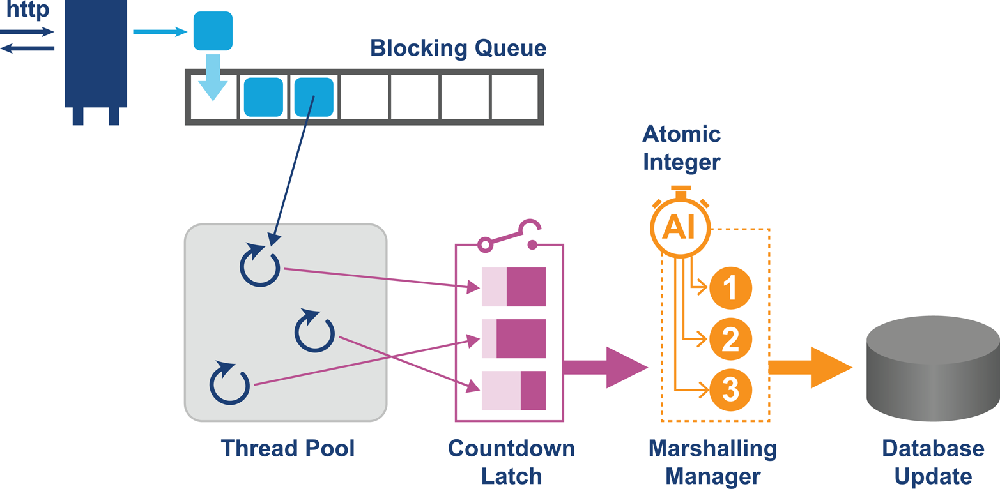

<!--
headingDivider: 2
-->


<!-- _class: title -->

# Optimizing Java

Chapter 12. Concurrent Performance Techniques

_2021-10-26_
_Kohei Sakai_

## ToC

この章で理解できること
- Javaの並行処理の方法の概要、ロックについて
- JMM
- java.util.concurrentの代表的なもの
- stream


## 並列処理の重要性

[Herb Sutter, The Free Lunch Is Over, 2005](http://www.gotw.ca/publications/concurrency-ddj.htm)
- トランジスタ数は増えているが、シングルコアの数は増えていかないこと
- パフォーマンスのための並行処理の重要性の指摘

この章ではあくまで基本的な概要だけを提供している。より詳しくは [Brian Goetz et al., Java Concurrency in Practice, 2006](https://learning.oreilly.com/library/view/java-concurrency-in/0321349601/) を参照。


# Introduction to Parallelism

## アムダールの法則

ある処理をシリアル処理のみで行った場合にかかる時間を $T$ とし、処理のうちシリアル処理でしかできない時間を $S$とする。並列数を $N$ として、処理にかかる時間 $T(N)$ は以下になる。

$$
T(N) = S + \frac{T-S}{N}
$$

$N$が十分大きくなれば、結局の所、Sが支配的なので、高速化の限界が近づくことになる。

## Fundamental Java Concurrency

並行処理でバグる、よくある例。

```java
public class Counter {
    private int i = 0;

    public int increment() {
        return i = i + 1;
    }
}
```

- OSのスケジューラがどのような順序で命令を実行するのか、という問題なので `volatile` をつけるだけでは駄目
    - volatile の簡単な説明は[このブログ](https://www.baeldung.com/java-volatile)が参考になるか?
- `synchronized` すれば大丈夫だが、パフォーマンスを犠牲にすることを理解すること

## Understanding the JMM

JMM = Javaのメモリモデル のこと。
[The Java Language Specification](https://docs.oracle.com/javase/specs/) の [Chapter 17](https://learning.oreilly.com/library/view/java-concurrency-in/0321349601/)あたりに書かれている。

JMMは以下のような疑問に答える
- 2つのコアが同じデータにアクセスするとどうなるか？
- 同じ値を見ることが保証されるのはいつか？
- メモリキャッシュはこれらの答えにどのような影響を与えるか？

大きくは、順序付けに関する保証と、スレッド間の更新の可視性に関する保証の2つが書かれている。

---

High levelでみると、JMMは2種類のメモリモデルがありえる
- Strong memory model → 採用しない⛔
    - すべてのコアがいつでも同じ値を見るモデル
    - ハードウェア的にこれを実装するには、メモリへのwrite-backアプローチになる。メモリ無効化の通知がメモリバスを圧迫することになる。ハードウェア支援のないアーキテクチャで実装する場合とんでもなく面倒なことになる
- Weak memory model → 採用✅
    - コアによって異なる値が表示されることがあるが、これを制御する特別なキャッシュルールがあるモデル
    - ただし、これはmin requirementであることに注意する。実際のJVM実装やCPUによって、JMMの要求よりもっと多くのことが行われることがある。例えば、より強力なメモリモデルを持つプラットフォームで開発されたアプリケーションが、JMMの下では並行性に関するバグを持つかもしれない。

---

JMMは以下のようなコンセプトに基づいて、保証をする。
- Happens-Before: ある事象が他の事象の前に必ず起こる
- Synchronizes-With: オブジェクトのビューをメインメモリと同期させる
- As-If-Serial: 実行中のスレッドの外側で、命令が順番に実行されているように見える
- Release-Before-Acquire: あるスレッドがロックを解放してから他のスレッドがロックを獲得する

この観点で考えると、 `synchronized` keywordが行うことは、threadのlocal viewをmain memoryに動悸させること。
逆に `synchronized` でないアクセスについては、JMMでは何も言及されていなく、あるスレッドで行われた変更が他のスレッドから見えるようになるのはいつなのか、ということについても保証されない。書き込みだけでなく、読み取りアクセスもsynchronizedされたセクションにないと、再読み取りは保証されない。

---


JMMのまわりの資料
- 初心者向け [The JSR-133 Cookbook for Compiler Writers](http://gee.cs.oswego.edu/dl/jmm/cookbook.html)
- より技術的な理解のための資料 [Close Encounters of The Java Memory Model Kind](https://shipilev.net/blog/2016/close-encounters-of-jmm-kind/)

# Building Concurrency Libraries

---

`java.util.concurrent` のライブラリは以下を提供する
- Lock と semaphores
- Atomics
- Blocking queues
- Latches
- Executors

> Figure 12-4. Example concurrent application


---

- 一部のライブラリは、低レベルプロセッサ命令やOSの仕様に依存して、CAS(_Compare and Swap_)と呼ばれる技術を提供している。
- CASの機能は、ほとんどの最新のプロセッサにハードウェアで実装されているにもかかわらず、JMMやJavaプラットフォームの仕様の一部にはなっていない。CASハードウェアへのアクセスはsun.misc.Unsafeクラスで提供されている。
    - 最近のJavaはもう少し変更していそう
    - https://blogs.oracle.com/otnjp/post/the-unsafe-class-unsafe-at-any-speed-ja

## Atomic and CAS

[atomic](https://docs.oracle.com/javase/jp/6/api/java/util/concurrent/atomic/package-summary.html): add, increment, decrement と get() の複合操作ができるライブラリ。

例は書籍参照。

atomicはlock-freeで、デッドロックはしない。
atomic操作に失敗した場合のために、内部のtry loopがついている場合がある。このループで複数回実行された場合に、パフォーマンスが落ちるので、[スレッドのコンテンションレベル](https://docs.oracle.com/javase/jp/8/docs/api/java/lang/management/ThreadMXBean.html?is-external=true)を監視すると良い。

## Locks and Spinlocks

[spinlockとmutexの比較](https://docs.oracle.com/cd/E19253-01/819-0390/ggecq/index.html)
- spinlockはbusy waitであって、ループで待つので待ってる間はCPUを食うが、ブロックを設定するのは軽量
- mutexはmutexをロックできないとき、スレッドがブロックされるのでCPUをそんなに食わないが、停止とロック獲得時のスレッドブロック解除のコストが高い。

非常に短期間のブロックであれば、spinlockのほうがオーバーヘッドがすくなることがある。

---

スピンロックは、ハードウェアがサポートしていれば、通常、CASで実装されている。low-level x86 assembly の例。
```
locked:
     dd      0

spin_lock:
     mov     eax, 1
     xchg    eax, [locked]
     test    eax, eax
     jnz     spin_lock
     ret

spin_unlock:
     mov     eax, 0
     xchg    eax, [locked]
     ret
```

# Summary of Concurrent Libraries

## Locks in java.util.concurrent

[java.util.concurrent.locks.Lock](https://docs.oracle.com/javase/jp/8/docs/api/java/util/concurrent/locks/Lock.html)

- lock()
- newCondition(): [java.util.concurrent.locks.Condition](https://docs.oracle.com/javase/jp/8/docs/api/java/util/concurrent/locks/Condition.html)
- tryLock()
- unlock()

[ReentrantLock](https://docs.oracle.com/javase/jp/8/docs/api/java/util/concurrent/locks/ReentrantLock.html) はLock interfaceの主な実装。
ロックを獲得したスレッドにReentrantLockが "所有" されるという考え方で、再入可能なロックになっている。(lockを取るごとに、保持カウントを+1するようになっているので、lockごとにunlockして良い)


---

`compareAndSwap()`の実際の呼び出しや、 `Unsafe` の使用法は、[`AbstractQueuedSynchronizer`](https://docs.oracle.com/javase/jp/8/docs/api/java/util/concurrent/locks/AbstractQueuedSynchronizer.html) のstatic subclass の `Sync` にある。

`AbstractQueuedSynchronizer` は [`LockSupport`](https://sun.ac.jp/prof/yamagu/java8docs/api/java/util/concurrent/locks/LockSupport.html) クラスも使っている。 LockSupport はスレッドにパーミットを発行して、パーミットがない場合にはスレッドが待機する。パーミットの考え方はセマフォに近いが、単一のパーミットしかない。 非推奨とされていた、 `Thread.suspend()`/`Thread.resume()` を置き換えるもの。

## Read/Write Locks

Cacheのように、reader:writer=N:1のような大きな偏りがあるとき、読み取りのために不必要にブロックすると大きなロスになる。[`ReentrantReadWriteLock`](https://docs.oracle.com/javase/jp/8/docs/api/java/util/concurrent/locks/ReentrantReadWriteLock.html) クラスはReadLockとWriteLockを公開している。
- readLockは複数のスレッドが取得できるが、writeLockは1つのスレッドのみが取得できる
- writeLockが取られているとき、readLock/writeLockはブロックされる
- readLockが取られているとき、writeLockはブロックされる
- writeLock待ちのスレッドがある場合のスレッドの割当の挙動は、fair モードによって異なる
    - fair=false(default): 順序は指定されない
    - fair=true: 近似の待機到着順になるが、writeLock待ちがある場合はwriteLock待ちスレッドを優先する
- readLock内では、writeLockによって更新された内容が認識される

## Semaphores

[Semaphore](https://docs.oracle.com/javase/jp/8/docs/api/java/util/concurrent/Semaphore.html)は単に利用可能な個数のカウントを保持し、それに応じた処理を行う。プール内のスレッドやデータベース接続オブジェクトなど、物理的または論理的な一部のリソースにアクセス可能なスレッド数を制限するためによく使用される。

Binary Semaphore(1-permit のsemaphore) はmutexとほぼ同じだけど、mutexには所有権があって、そのスレッドでしかreleaseできないのに対し、Semaphoreには所有権がないので、他スレッドからreleaseできる。

また、Semaphore は1つのスレッドが複数のパーミットを要求したり解放できるという利点があるが、これをする場合にはfairをtrueにしておかないと、スレッドが餓死する可能性が上がる。

## Concurrent Collections

バケットやセグメントに分割してロック範囲を小さくしているなど、自前で雑に実装するよりも効率的な実装になっている。

- [ConcurrentHashMap](https://docs.oracle.com/javase/jp/8/docs/api/java/util/concurrent/ConcurrentHashMap.html)
- [CopyOnWriteArrayList](https://docs.oracle.com/javase/jp/8/docs/api/java/util/concurrent/CopyOnWriteArrayList.html)
- [CopyOnWriteArraySet](https://docs.oracle.com/javase/jp/8/docs/api/java/util/concurrent/CopyOnWriteArraySet.html)

## Latches and Barriers

Latch は複数のスレッドの処理の終了を待って何かを実行する、というようなケースで便利。
- [CountDownLatch](https://docs.oracle.com/javase/jp/8/docs/api/java/util/concurrent/CountDownLatch.html)
Latchはリセットがなく、一度0になるともう再使用できない。

[CyclicBarrier](https://docs.oracle.com/javase/jp/8/docs/api/java/util/concurrent/CyclicBarrier.html) を利用する手もある。こちらはリセット可能。

# Executors and Task Abstraction

---

スレッドに関する懸念が少ない抽象レベルは、_concurrent task_ と表現する。つまり、現在の実行コンテキスト内で同時に実行することが要求されるコードや作業の単位のこと。
タスク単位で考えると、タスクを実行する実際にスレッドライフサイクルを考えなくて良いので、並行プログラムの記述が楽になる。

## Introducing Asynchronous Execution

 [Callable<V>](https://docs.oracle.com/javase/jp/8/docs/api/java/util/concurrent/Callable.html)インターフェースは、結果を返し例外をスローすることがあるタスクを表す。 ([Runnable](https://docs.oracle.com/javase/jp/8/docs/api/java/lang/Runnable.html) は結果を返さず、チェック例外もスローしない)

[ExecutorService](https://docs.oracle.com/javase/jp/8/docs/api/java/util/concurrent/ExecutorService.html)インターフェースは、mangedなスレッドプールでタスクを実行するメカニズムを定義するインターフェース。 `submit()` メソッドで `Callable<T>`や `Runnable` のインスタンスを受け取る。

---

[Executors](https://docs.oracle.com/javase/jp/8/docs/api/java/util/concurrent/Executors.html) クラスは、指定されたfactoryメソッドに応じて、サービスとthread poolを構築する。
- newFixedThreadPool(int nThreads)
- newCachedThreadPool()
- newSingleThreadExecutor()
- newScheduledThreadPool(int corePoolSize)
- newWorkStealingPool()

タスクが送信されると、非同期に処理され、送信側のコードは結果をblockするかpollingするかを選択できる。
`submit()` は [`Future<V>`](https://docs.oracle.com/javase/jp/8/docs/api/java/util/concurrent/Future.html) を返す。これを使って、blockされるget()やisDone()を使用したノンブロッキング呼び出しをすることも可能。

## Fork/Join

[ForkJoinPool](https://docs.oracle.com/javase/jp/8/docs/api/java/util/concurrent/ForkJoinPool.html)

Java 7からFork/Joinフレームワークが導入され、複数のプロセッサを効率的に使用するための新しいAPIが提供されている。

work-stealing アルゴリズムを使用する点で、他の種類のExecutorServiceとは異なる。
ほとんどのタスクが他のサブタスクを生成する場合や、外部のクライアントからプールに小さいタスクが数多く送信される場合に、効率的な処理が可能になる。

分割統治的な処理以外にも、Akkaフレームワークや `parallelStream()` でもForkJoinPoolが利用されている。

# Modern Java Concurrency

## Streams and Parallel Streams

Java 8の最大の変更点はlambdaとstreamの導入。
Java [Stream](https://docs.oracle.com/javase/jp/8/docs/api/java/util/stream/Stream.html) はデータソースからのアイテムの普遍のシーケンス。片付けされたデータの任意のソース(IO, Collection)を使用できる。
parallel streamを常に使いたくなるかもしれないが、追加のコストがかかるので、常に注意を払う必要がある。パフォーマンステストをしよう。

[Streamの例](https://wandbox.org/permlink/xFUxEicQKVbeiMkY)

## Lock-Free Techniques

ロックを使う場合、スレッドがコンテキストスイッチされて、もう一方のプロセッサに戻ってくる可能性がある。pauseとwakeに時間がかかるのもあって、ロックはロックフリーの技術よりもはるかに遅い可能性がある。

[LMAX-Exchange/disruptor](https://github.com/LMAX-Exchange/disruptor/wiki/Performance-Results) による、lock-freeな Disruptor パターンがある。

## Actor-Based Techniques

スレッドよりも何らかの形で小さいタスクを表現するさまざまなアプローチが登場している。
その1つが、actor paradigm。

`Actor` とは、小さなself-containedな処理の単位で、独自の状態、動作を持ち、他のaktorと通信するためのメールボックスを持つ。
actor間は、mutableな状態は共有せずに、immutableなメッセージでのみ相互に非同期通信する。
この抽象化によって、actorは別のマシンにあっても良く、Fault toleranceが必要な場合にも機能する。

Java では [Akka](https://akka.io/)が有名。

# Summary

避ける
- どこでも並列ストリームを使用する
- 手動ロックで複雑なデータ構造を作成する
- java.util.concurrent ですでに定義されているものを再実装する


目指す
- 並行コレクションを利用して、スレッドのホットパフォーマンスを向上させる
- ロックは減らす
- スレッドを直接処理しなくて済む、適切なタスク/非同期抽象化を提供する

現代は、より高レベルの並行性モデルに移行していく傾向にあるので、それに乗るほうが良いかもしれない。