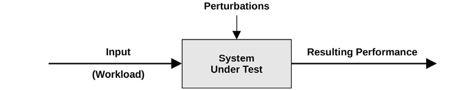
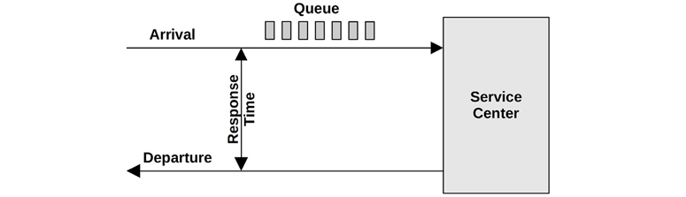
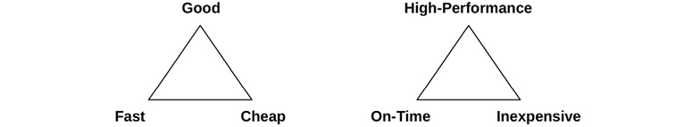
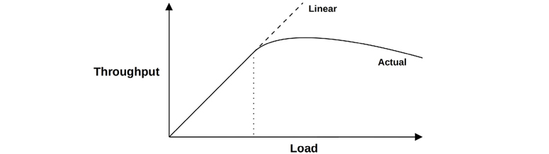
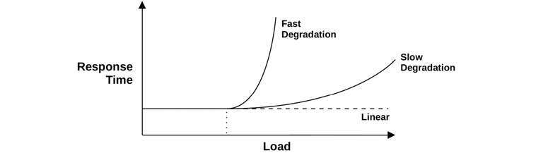
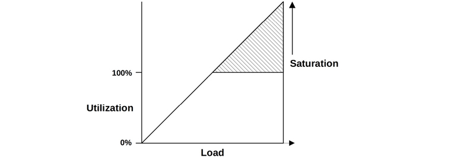
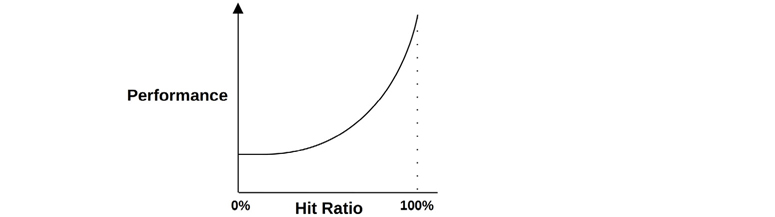

<!--
headingDivider: 2
-->

<!-- _class: title -->

# Systems Performance, 2nd Edition

Chapter 2. Methodologies (2.1-2.4)

_2022-05-11_
_Kohei Sakai_

## ToC

章全体としては全体概要として、色んなコンテンツが入っている。

* 主要な性能指標(latency, utilization, saturation)を理解する
* nanosec単位で計測した時間スケールを把握する
* チューニングのトレードオフ、ターゲット、解析の停止をいつするかを学ぶ
* ワークロード vs アーキテクチャの間の問題を特定する
* リソース vs ワークロードの分析について考える
* USEメソッド、ワークロード特性、レイテンシ分析、静的パフォーマンスチューニング、パフォーマンスマントラなど、様々なパフォーマンス手法に従う
* 統計学と待ち行列理論の基本を理解する

---

この章は3つのパートからなる

* Background
    * 用語や基本的なモデル、重要な性能のコンセプトと視点を紹介
    * この本の基礎知識
* Methodology
    * 観測的/実験的なパフォーマンス解析手法について議論
    * モデリングやキャパシティプランニング
* Metrics
    * パフォーマンス統計、モニタリング、可視化の紹介

## 2.1 Terminology

本の最後の方に、Glossaryがあるので、気になったらそれを見る。

* IOPS: Input/output operations per second. 例: disk IOでいうと1秒あたりの読み書き。
* Troughput: The rate of work performed. よく bps, ops, qpsなどで表される系のやつ。
* Response time: 応答時間。結果を転送する時間や、待機時間、サービスを受ける時間が含まれる。
* Latency: 待ち時間。サービスを受けるために待つ時間。文脈によっては、操作の全時間を指すこともあり、応答時間と同じものを指すこともある。
* Utilization: 利用率
* Saturation: 飽和。リソースが処理できない仕事をキューに入れている割合
* Bottleneck: システムの性能を制限するリソースのこと
* Workload: システムへのインプット。データベースなら、クライアントから送信されるDBクエリ/コマンド。
* Cache: キャッシュ

## 2.2 Models

System Under Test(SUT)
* Perturbationsを認識することが大事

Queueing System
* キューイングシステムとしてモデル化すると良いシステムもある

## 2.3 Concepts

---

### 2.3.1 Latency

重要性や色んなポイントでレイテンシが計測できることはよく知っていると思うので省略。

色々なレイテンシがあっても、時間ベースの指標であることは変わらないので、ランク付けやチューニング時の予想される高速化の計算を行うこともできる。
ディスクとネットワークのIOPSで、比較することは難しいことが多いが、latencyで比較すればどちらに処理が多いと困るかは比較が簡単。

## 2.3.2 Time Scales

(テキスト参照: 有名なやつ)

CPU cycleから見ると、メモリやディスク、ネットワークアクセスがどの程度遅いか

## 2.3.3 Trade-Offs

一般的なパフォーマンストレードオフについて。 Trade-offs: pick two

on-time & inexpensiveを選択すると、performanceの改善が難しくなる。
性能のチューニングでよくあるのは、CPU/メモリのトレードオフで、メモリを効率良く使うために、CPU時間をデータ圧縮に費やすことで、メモリ使用率を減らすことができる。

また、パラメータを変更するとトレードオフを伴うことがある
* ファイルシステムレコード(orブロック)サイズ: アプリのIOサイズに近い程度に小さいと、ランダムIOパフォーマンスは良くなるが、バックアップなどのストリーミングでは悪くなる。
* ネットワークバッファサイズ: バッファが小さいとconnectionごとのオーバーヘッドはヘルが、サイズが大きいとスループットが向上。

## 2.3.4 Tuning Efforts

パフォーマンスチューニングは、作業が行われる場所に最も近い場所で行うのが効果的。
(アプリをチューニングしたいなら、アプリケーションロジックや、リクエストキューサイズ、データベースクエリなど。)

例えば、実際にはクエリを効率化できる場面で、DBをチューニングしても、大抵は数％~数十%程度しかパフォーマンスは向上しない。

## 2.3.4 Tuning Efforts (Cont.)

アプリケーションレベルで大きな性能向上が見られる理由がもう1つある。
最近の環境では、デリバリーを迅速に行うことが重視されている。
→ そうすると、開発やテストは正確さに焦点が当たる
→ 本番環境導入前にパフォーマンス測定や最適化が行われることがない。(我々もそうかも)

ただ、観測のベースとして、アプリケーションが効果的とは限らない。
遅いクエリは、CPU timeや、ファイルシステム、ディスクI/Oなどから観測される可能性がある。
アプリケーションレベルの問題を、アプリケーションだからからよりも簡単に特定できる可能性があることを忘れないように。

## 2.3.5 Level of Appropriateness

* ある組織で行われている分析のレベルが、他の組織では基本的な分析であることや、高度な分析であることはよくある。
    * パフォーマンスの専門知識に対するROI次第
    * コスト削減だけではなくて、UXや顧客満足度にも関わるので、ROIとして評価する際にはコスト以外も検討する
* 最も過酷な環境は証券取引所や高頻度取引で、ニューヨーク・ロンドン取引所間の大西洋横断ケーブルは、6ms短縮するために3億ドルかけて計画された

性能分析を行う場合、いつ分析をやめるかを決める際にも、適切さのレベルが関わる

## 2.3.6 When to Stop Analysis

1. **When you’ve explained the bulk of the performance problem.**
    * あるJavaアプリが3倍のCPUを消費していて、例外スタックの1つがCPUを消費していることを見つけたが、CPU時間を定量化すると、12％程度だった
    * もしこれが66%近ければ3倍であることを説明できたが12%だったので、調査を継続した
2. **When the potential ROI is less than the cost of analysis.**
    * 莫大な利益を生むものなら、解析に何ヶ月もかけられるが、年間数百ドルの価値しかなければ、それほど時間がかけられない
    * もちろん、後々大きな問題を引き起こす可能性があり、問題が大きくなる前にデバッグする価値があると判断した場合など、例外はある
3. **When there are bigger ROIs elsewhere.**
    * 前の2つのシナリオに当てはまらなくても、もっと大きなROIがある場合もある

## 2.3.7 Point-in-Time Recommendations

状況によってボトルネックは変わる。例えば、10Gbps時代と100Gbps時代は違う。[例](https://www.slideshare.net/yuukitsubouchi/100gbps)
パフォーマンスに関する推奨事項、特にパラメータまわりの話は、特定の時点でだけ有効。

(そういえば、[最近読んだブログ](https://blog.s-style.co.jp/2022/04/8765/)を見て、パラメータの考え方を変えないといけないと思った。こういうのはインフラに近い人はよく経験しているはず。)

## 2.3.8 Load vs. Architecture

アプリケーションのパフォーマンス問題があったとき、動作しているアーキテクチャや実装に問題がある場合と、単純に負荷の問題の場合がある。

アーキテクチャを分析しても問題がないのに、負荷がキューイングされていれば、負荷が大きすぎる。必要に応じてリソースを増やせば解決する。

アーキテクチャの問題の例
* シングルスレッドアプリで、他のCPUが空いていてアイドルなのに、CPUがビジー状態になっていて、リクエストがキューイングされている
* マルチスレッドアプリで、ロックが競合していて、1スレッドだけが動いている

## 2.3.9 Scalability

典型的なスケーラビリティの様子。

最初は線形に近いかたちでスケールするが、あるところから伸びが落ち、あるところから下がる。

例として、重い計算を行うアプリケーションで、スレッドを追加することでより多くの負荷が加わる。
CPU使用率が100%に近づくと、スケジューラーのレイテンシーが増加し、応答時間の劣化が始まり、ピーク性能の後、利用率が100%になると、スレッドの追加に伴いスループットが低下し始める。コンテキストスイッチが多く発生し、CPUリソースを消費して性能低下する。

---

非線形のスケーラビリティの様子。

"slow" の例
* CPU負荷の増大

"fast"の例
* メモリページをディスクに移動して、メインメモリを開放
* HDDでIOが増大したとき。(細かいことは、2.6.5, 9章で説明)

応答時間を線形スケーラビリティにするには、作業キューに入れずに、リソースが利用できないエラーを返すようにすることで起きる可能性がある。

## 2.3.10 Metrics

一般的なタイプのメトリクス
* Throughput
* IOPS
* Utilization
* Latency

メトリクスを取るためにも、収集や保存でCPUサイクルを使うし、オーバーヘッドがある。(オブザーバー効果)

*注意:* メトリクス自身が混乱しやすく、複雑で信頼性の低い、不正確なものの可能性がある。
バグや、コード変更時に変更が反映されないこともありえる。(詳細は 4.6で)

## 2.3.11 Utilization

利用率は、time-basedと、capacity-basedの2種類がある。

### time-based
Uを使用率。Tは計測期間、BはTのうちでビジー状態だった合計時間として、
$$
U = \frac{B}{T}
\\
$$

iostatでも、 %b(%busy)として、取得できるタイプの使用率。

ただ、コンポーネントによっては、このタイプの使用率が100%でも追加の処理ができる可能性がある。

---

### capacity-based

システムやコンポーネントはある量のスループットを提供できる。
それに対するスループットの割合をcapacity-basedの使用率とする。

この定義の場合、100%の使用量のディスクは、それ以上仕事を入れられない。
また、100%のビジー状態は、100％のcapacity 使用率を意味しない。

ただ、capacity-basedの使用率は計測が難しい。

この本では、利用率といったとき、通常はtime-basedのものを指す。

## 2.3.12 Saturation

saturation=あるリソースに対して、そのリソースが処理できる以上の仕事が要求される度合い。
capacity-basedの使用率100%で発生し始め、処理しきれない余分な作業が出て、キューに入る。

time-basedだと、利用率100%ではsaturationが始まらない場合もある。

## 2.3.13 Profiling

プロファイリングは、大まかなターゲットのイメージを作るのに使う。
通常、時間間隔でサンプリングし、サンプル集合を調査することで実行する。

## 2.3.14 Caching

キャッシュの性能を理解する指標
* キャッシュヒット率
* キャッシュミスレート = 単位時間あたりのキャッシュミス数

---

### Algorithms

キャッシュ管理のアルゴリズム

* MRU(Most Recently Used)
    * 最も最近使用されたオブジェクトを保持することを優先
* LRU(Least Recently used)
    * 最も使われていないオブジェクトを削除する
* NFU(Not frequently used)
    * LRUの雑なバージョン

---

### Hot, Cold, and Warm Caches

キャッシュ状態のこと

* Cold
    * 空だったり不要データで満たされている
    * cache hit rate = 0
* Warm
    * hotほどではないが、有用なデータがある状態
* Hot
    * よく要求されるデータが配置されている状態
    * 99%以上の高いhit rate
* Warmth
    * どの程度キャッシュがhot/coldかを表す

キャッシュが最初に初期化されるとき、coldから始まって、徐々にhotに近づいていく。
キャッシュが大きかったり、データストレージが遅い場合には、キャッシュが暖かくなるまでに時間がかかる。

## 2.3.15 Known-Unknowns

* *knowns-knowns*
    * 既知の事項
    * ある性能指標をチェックすべきと知っていて、その値も知っている
    * 例: CPU使用率をチェックすべきで、その値が10%であることを知っている
* *knowns-unknowns*
    * 知っているようで知らないこと
    * ある指標やサブシステムの存在を確認できることは知っているが、まだ観察していないこと
    * 例: CPUをビジー状態にしているものがプロファイリングで確認できることを知っているが、まだ実施していない状態
* *unknowns-unknowns*
    * 知らないということを知らないこと
    * 例: デバイス割り込みが、CPUを大きく消費することを知らず、チェックできていない場合

パフォーマンスは、知れば知るほど知らないことが増える分野。学べば学ぶほど、 *unknowns-unknowns* → *knowns-unknowns* → *knowns-knowns* となる。

## 2.4 Perspectives

---

### 2.4.1 Resource Analysis

ボトムアップアプローチ。
システムリソース(CPU、メモリ、ディスク、ネットワークインターフェイス、バス、インターコネク トなど)の解析から始める。

リソースがいつ限界に達するか、または限界に近づくかを特定するために、使用率に焦点。

メトリクスとしては、IOPS, Throughput, Utilization, Saturationあたりを見ることになる。

---

### 2.4.2 Workload Analysis

トップダウンアプローチ。
アプリケーションパフォーマンスの調査。適用されたワークロードと、アプリケーションがどのように応答しているか。

解析対象
* Requests
* Latency
* Completion: エラーの有無

## ここまで