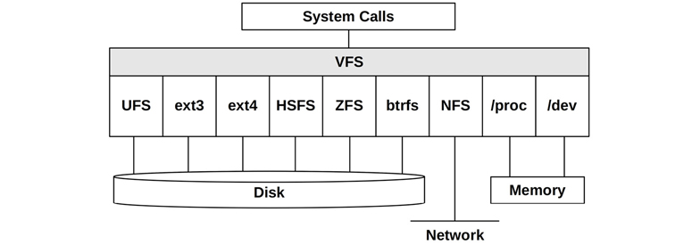
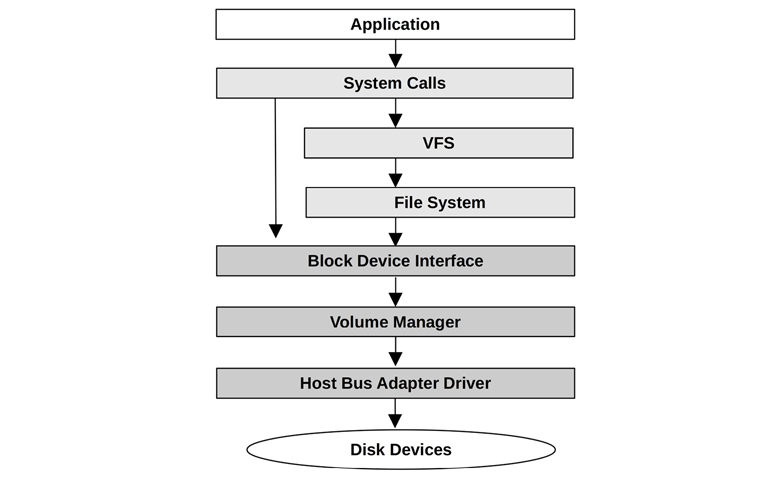
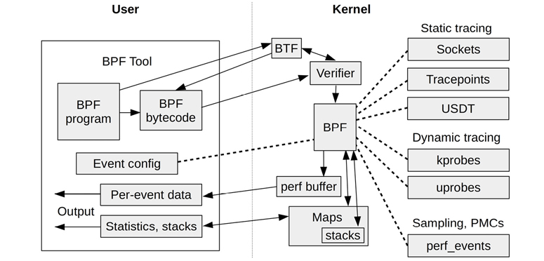

<!--
headingDivider: 2
-->


<!-- _class: title -->

# Systems Performance, 2nd Edition

Chapter 3. Operating Systems (3.2.10 - )

_2022-08-22_
_Kohei Sakai_

## ToC

## 3.2.10 File Systems

ファイルシステムのことは知っていると信じるが

* ファイルに対して、POSIX 標準に基づいてアクセスするためのインターフェイスをOSが提供
* ファイルと、それをまとめるディレクトリが、`/` から始まるツリー構造で編成されている
* `mount` という操作によって、独自のツリーをマウントポイントにアタッチできる
    * ファイルシステムタイプに依存せずに、ツリーをたどることでアクセスできる

多くのファイルシステムはストレージデバイスを使ったものだが、 `/proc` `/dev` などはkernelが動的に生成する。
kernelはchroot(8)やmount namespaceなど、プロセスごとにファイルシステム名前空間を分離する方法を提供する。

※そういえば chroot(8)の(8)って何を意味しているか知ってるか聞いてみる

---

### VFS

VFS = _virtual file system_
新しいファイルシステムタイプを追加するときに、便利な仕組み。
[Overview of the Linux Virtual File System](https://www.kernel.org/doc/html/latest/filesystems/vfs.html)


Figure 3.14 Virtual file system

---

### I/O Stack

ストレージデバイスベースのファイルシステムでの、ユーザーレベルのストレージアクセス。
ファイルシステムを介さない、ブロックデバイスの直接のパスは、DBなどで利用されることがある。


Figure 3.15 Generic I/O stack

## 3.2.11 Caching

[このテーブル](https://learning.oreilly.com/library/view/systems-performance-2nd/9780136821694/ch03.xhtml#ch03tab02)にある通り、いろんなキャッシュがある。

## 3.2.12 Networking

詳細はChapter 10。

カーネルは、ビルトインのネットワークプロトコルを内蔵したスタックを提供している。
一般的に利用されるTCP/IPプロトコルにちなんでTCP/IPスタックとも呼ばれ、ユーザーレベルのアプリケーションは、ソケットを介してネットワークにアクセスする。

QUIC(Ref. Chapter 10)のサポートといった、新しいプロトコルや拡張、オプションなどはカーネルのサポートを必要とする。(ユーザースペースで実装するときは、もちろん違う)
また、新しいNICのサポートは、新しいデバイスドライバが必要になる。

## 3.2.13 Device Drivers

ドライバ=デバイスの管理と入出力を行うためのカーネルソフトウェア

デバイスドライバは2種類のインターフェースを提供できる。

* Character Interface: 任意のI/Oサイズのバッファなしシーケンシャルアクセスを提供
    * キーボード、シリアルポートなど
* Block Interface: あるブロック(歴史的に512byteごと)単位でI/Oを実行する。ブロックオフセットに基づいて、ランダムアクセスできる
    * 性能向上のために、Linuxではバッファキャッシュを提供している

## 3.2.14 Multiprocessor


アーキテクチャとして大きく2つある。この本で話されている気がするので割愛。 [間違ってたとき用のリンク](https://www.itmedia.co.jp/news/articles/2208/04/news099.html)

詳細は Chapter 6: CPUsや、Chapter 7: Memoryで話される。

* SMP(_Symmetric Multiprocessing_)
* NUMA(_Non-Uniform Memory Access_)


---

### IPI

IPI=_inter-processor interrupt_

マルチプロセッサシステムでは、キャッシュコヒーレンシなどCPU間の連携が必要な場合がある。
IPIは次で説明するpreemptionでも使う。

## 3.2.15 Preemption

Kernel preemption=優先度の高いユーザースレッドがカーネル処理に割り込んで実行する機能

与えられた時間内で作業を実行するリアルタイムシステムを実現するために利用する。(cf. RTOS)

* [realtime:start [Wiki]](https://wiki.linuxfoundation.org/realtime/start)
    * [Preemption Models](https://wiki.linuxfoundation.org/realtime/documentation/technical_basics/preemption_models)
* [スタンドアロン方式とリアルタイム性能 - MONOist](https://monoist.itmedia.co.jp/mn/articles/0506/28/news112.html)
* [Linuxのプリエンプションモデル - 言多の備忘録](https://wiki.chobits.com/?Linux%E3%81%AE%E3%83%97%E3%83%AA%E3%82%A8%E3%83%B3%E3%83%97%E3%82%B7%E3%83%A7%E3%83%B3%E3%83%A2%E3%83%87%E3%83%AB)

## 3.2.16 Resource Management

OSはCPU、メモリ、ディスク、ネットワークなどのシステムリソースへのアクセスをチューニングするための設定を提供することがある。
異なるアプリケーションを実行するシステムや、マルチテナントのシステムで、個別のプロセスで固定の制限を与えるよりも、柔軟なアプローチで割当を許可することもできる。

以前から、 `nice(1)` や `ulimit(1)` などの基本的なリソース制限があった。
最近では、 cgroups v2 があり、リソース制限できる。また後の章で説明されるらしい。

* [Control Group v2](https://www.kernel.org/doc/Documentation/cgroup-v2.txt)
    * [Control Group v2(翻訳) - tenforward/cgroup-v2-doc](https://github.com/tenforward/cgroup-v2-doc/blob/master/cgroup-v2.md)
* [LXCで学ぶコンテナ入門 －軽量仮想化環境を実現する技術](https://gihyo.jp/list/group/LXC%E3%81%A7%E5%AD%A6%E3%81%B6%E3%82%B3%E3%83%B3%E3%83%86%E3%83%8A%E5%85%A5%E9%96%80-%E8%BB%BD%E9%87%8F%E4%BB%AE%E6%83%B3%E5%8C%96%E7%92%B0%E5%A2%83%E3%82%92%E5%AE%9F%E7%8F%BE%E3%81%99%E3%82%8B%E6%8A%80%E8%A1%93)
    * [cgroup v2から使うコントローラとmiscコントローラ](https://gihyo.jp/admin/serial/01/linux_containers/0048)
    * [cgroup v2のリソース分配の方法とインターフェースファイルの操作](https://gihyo.jp/admin/serial/01/linux_containers/0049)

## 3.2.17 Observability

Chapter 4でやるのでskip。

## 3.3 Kernels

このセクションでは、Unix-likeなカーネル実装の詳細について、性能に焦点を当てながら説明する。Linux kernelについては、 Chapter 3.4で説明する。

Kernelの違いとしては、以下のようなものがある。
* サポートするファイルシステム (Chapter 8)
* system call インターフェース
* ネットワークスタックアーキテクチャ
* リアルタイムサポート
* CPUのスケジューリングアルゴリズム
* disk I/O
* ネットワーク

[Table 3.3 Kernel versions with documented syscall counts](https://learning.oreilly.com/library/view/systems-performance-2nd/9780136821694/ch03.xhtml#ch03tab03)

## 3.3.1 Unix

1969年、AT&Tベル研究所で、Ken Thompson, Dennis Ritchie らによって開発された。
* Ken Thompson: UTF-8, Golangの人でもある
* Dennis Ritchie: C言語の人で、有名なK&R本のプログラミング言語Cの人でもある

kernelは小さいながらに、高性能を実現するための機能をいくつか備えていた。
* プロセスにはスケジューラの優先順位があり、優先順位の高い作業のRunキューの待ち時間を短縮
* ディスクIOは効率化のために大きなブロック(512byte)で実行され、メモリ内のデバイスごとのbuffer cacheにキャッシュ
* Idleプロセスはストレージにスワップアウトされ、よりbusyなプロセスはメインメモリで実行
* マルチタスクにも対応していて、複数プロセスを同時に実行することでジョブのスループットを向上

## 3.3.2 BSD

BSDはカルフォルニア大学バークレー校でUnix 6th Editionの拡張版として始まり、1978年にリリース。UnixコードはAT&Tソフトウェアライセンスだったため、1990年代まで新しいBSDライセンスのもとBSDで書き直され、FreeBSDを含む自由なディストリビューションになった。

BSDはLinuxほど普及していませんが、NetflixのCDNや、NetApp,Isilonといったファイルサーバーなど、パフォーマンスが重要な環境で使われている。


cf: Netflix情報
* [Netflix and FreeBSD: Using Open Source to Deliver Streaming Video](https://papers.freebsd.org/2019/FOSDEM/looney-Netflix_and_FreeBSD.files/FOSDEM_2019_Netflix_and_FreeBSD.pdf)
* [Serving Netflix Video Traffic at 800Gb/s and Beyond](http://nabstreamingsummit.com/wp-content/uploads/2022/05/2022-Streaming-Summit-Netflix.pdf) ( [Netflixはどのようにして800Gb/sものデータ転送を実現しようとしているのか？ - gigazine](https://gigazine.net/news/20220822-streaming-summit-netflix-2022/) )

---

BSD kernelの主な開発成果(特に性能関連)は以下の通り。

* **ページングされた仮想メモリ**: メインメモリを開放するために、プロセス全体をスワップアウトする代わりに、LRUでメモリのチャンクをページ化することができた *
* **必要に応じたページング**: 物理メモリと仮想メモリのマッピングを、最初に書き込まれたときまで延期する
* **FFS**: The Berkeley Fast File System。ディスクの割当をシリンダーグループにグループ化して、断片化を大幅に減らし、回転ディスクの性能向上させ、さらに大きなディスクや他の拡張をサポート
* **TCP/IP network stack**: Unix用の最初のTCP/IPネットワークスタックを開発
* **Sockets**: Berkeley socketsは接続エンドポイント用のAPI。ネットワーキングの標準になった。
* **Jails**: 軽量なOSレベル仮想化。複数のゲストが1つのカーネルを共有する
* **Kernel TLS**: TLS処理をカーネルに移して性能を向上

FreeBSDの内部に関する優れた参考文献: [The Design and Implementation of the FreeBSD Operating System, 2nd Edition](https://learning.oreilly.com/library/view/design-and-implementation/9780133761825/)

## 3.3.3 Solaris

Solarisは1982年にSun Microsystems社によって作られたUnixおよびBSD由来のカーネルとOS。
当初はSunOSと名付けられて、Sunワークステーションように最適化されていた。1980年代後半に、AT&TがSVR3,SunOS,BSD,Xenxの技術をベースに、新しいUnix規格であるUnix System V Release 4(SVR4)を開発すると、SunはSVR4をベースに新しいカーネルを作り、Solarisという名前でOSをリブランディングした。

2010年にオラクルがSun Microsystemsを買収し、SolarisはOracle Solarisと呼ばれるようになった。

---

Solarisの主な開発成果(特に性能関連)は以下の通り。

* **VFS**: The virtual file system。複数のファイルシステムを容易に共存させるための抽象化およびインターフェース。
* **Fully preemptible kernel**: リアルタイム作業を含む、優先順位の高い作業に対して、低レイテンシーを提供
* **マルチプロセッサのサポート**: ASMP/SMPのカーネルサポート
* **Slab allocator**: 事前に割り当てられたバッファをCPUごとにキャッシュして、素早く再利用できるようにして、性能を向上。
* **DTrace**: 静的、動的なトレースフレームワークとツール。ソフトウェアスタック全体をリアルタイムで観測することができる。LinuxではBPFとbpftraceが対応。
* **Zones**: 1つのカーネルを共有するOSインスタンスを作成するOSベースの仮想化技術。Linuxのコンテナとして普及。
* **ZFS**: エンタープライズレベルの機能と性能を持つファイルシステム。Linuxを含む他のOSでも利用可能。


## 3.4 Linux

1991年にLinus Torvaldsによって、free operating systemとして作ら、Usenetへの投稿で発表された。
LinuxはUnix, BSD, Solaris, Plan9などの多くの祖先から一般的なアイディアを取り入れて開発された。

## 3.4.1 Linux Kernel Developments

Linuxカーネルの開発で、特に性能に関するものには次のようなものがある。
本のうち、一部だけここに書く。
全部のリストは、 [3.4.1 Linux Kernel Developments](https://learning.oreilly.com/library/view/systems-performance-2nd/9780136821694/ch03.xhtml#:-:text=3.4.1)を参照。

---

* **CPUスケジューリングクラス**: NUMAに関して良い判断をするためのスケジューリングドメインなど
* **I/Oスケジューリングクラス**: デッドライン、先読み、完全公平キューイング(CFQ)など様々なブロックI/Oスケジューリングアルゴリズムを開発。現在はマルチCPU版。
* **TCP congestion(輻輳)アルゴリズム**: Reno, CubicなどのTCP輻輳制御アルゴリズムを設定することができる。
* **Overcommit**: OOM killerと並んで、少ないメインメモリで多くのことを行うための戦略。
* **Futex**: fast user-space mutex。
* **Huge pages**: カーネルとMMU(memory management unit)によって事前に割り当てられた大きなメモリページをサポート。(Chapter 7)
* **epoll**: 多くのopenなfile descriptorに対して効率的にI/O待機するためのシステムコール
* **cpusets**: プロセスのための排他的なCPUグループ分け
* **inotify**: ファイルシステムイベントを監視するためのフレームワーク
* **splice**: ユーザ空間を経由せずに、ファイルディスクリプタとパイプの間で、データを高速に移動させるシステムコール。 `sendfile(2)` は `splice(2)` のラッパーになっている

---

* **DynTicks**: idle時にカーネルタイマーの割り込みを発生させないようにし、CPUリソースと電力を節約することができる
* **cgroups/cgroups v2**: プロセスグループに対してリソースの使用量を制限できる
* **TCP LRO/LSO**: TCP Large Receive Offload(LRO)/Large Send Offload (LSO)。ネットワークドライバやハードウェアが、パケットをネットワークスタックに送信する前に、より大きなサイズに集約することを可能にする
* **KVM**: 独自のカーネルを実行する仮想オペレーティングシステムインスタンスを作成することができる。
* **Extended BPF(eBPF)**: 安全なカーネルモードプログラムを実行するためのカーネル内実行環境。eBPFの大部分は4.x系列で追加
* **Overlayfs**: 他のファイルシステムの上に仮想的なファイルシステムのを作成し、最初のファイルシステムを変更することなく、変更することもできる。コンテナでよく使われる
* **DAX**: userspaceがバッファのオーバーヘッドなしに、永続記憶ストレージデバイスから直接読み取ることを可能に
* **XDP**: eXpress Data Path。BPFベースの高性能ネットワーク用プログラマブル高速パス。ネットワークスタックの多くをバイパスできる、 `AF_XDP` ファミリが追加

---

* **Kernel TLS**: Linux版カーネルTLS
* **UDP GRO (5.0)**。UDP Generic Receive Offload(GRO)は、ドライバとカードでパケットを集約してスタックに渡すことを可能に
* **io_uring(5.1)**: アプリケーションとカーネルの間の高速通信のための、汎用非同期インターフェース。共有リングバッファを使用。主な用途は、高速ディスクやネットワークI/O
* **MultiPath TCP(5.6)**: 複数のネットワークリンク (例: 3G と WiFi) を使用して、単一の TCP 接続の性能と信頼性を向上できる
* **perf flame graphs(5.8)**: `perf(1)` がフレームグラフの視覚化をサポート

## 3.4.2 systemd

systemdはLinuxでよく使われるサービスマネージャ。システムの起動時間のチューニングを行う場合、 `systemd-analyze(1)` が役立つかも。

```
# systemd-analyze
Startup finished in 1.657s (kernel) + 10.272s (userspace) = 11.930s
graphical.target reached after 9.663s in userspace
```
```
# systemd-analyze critical-chain
...
graphical.target @9.663s
...
              └─systemd-networkd-wait-online.service @3.498s +1.860s
...
```

この出力は、クリティカルパス(遅延の原因となる一連のサービス)を示している。最も遅いサービスはsystemd-networkd-wait-online.serviceで、起動に1.86秒かかっている。

## 3.4.3 KPTI (Meltdown)

2018年のLinux 4.14に追加されたKPTI（Kernel Page Table Isolation）パッチは、["meltdown"](https://meltdownattack.com/) ( [【図解】CPUの脆弱性[Spectre/Meltdown]と投機的実行の仕組み〜分岐予測とアウトオブオーダー実行〜](https://milestone-of-se.nesuke.com/sv-advanced/sv-security/meltdown-spectre/) )と呼ばれるIntelプロセッサの脆弱性に対する緩和策。ただ、セキュリティ問題を回避する一方で、余分なCPUサイクルやコンテキストスイッチ、システムコールでの余分なTLBフラッシュが発生し、パフォーマンスを低下させる。
プロセスコンテキスト ID (PCID) をサポートし、プロセッサが pcid をサポートしていれば、一部の TLB フラッシュを回避することができるようになった。


[KPTI/KAISER Meltdown Initial Performance Regressions - Brendan Gregg's Blog](https://www.brendangregg.com/blog/2018-02-09/kpti-kaiser-meltdown-performance.html)

## 3.4.4 Extended BPF

BPF(Berkley Packet Filter)自体は、命令セット、ストレージオブジェクト(マップ)、ヘルパー関数から構成される。BPFのプログラムは、カーネルモードで動作し、ソケットイベント、tracepoints、USDT probes、kprobes、uprobes、perf_eventsといったイベントに対して動作するよう設定される。
Chapter 15などでbccとbpftraceなどを使用する。


[Figure 3.16 BPF components](https://learning.oreilly.com/library/view/systems-performance-2nd/9780136821694/ch03.xhtml#ch03fig16)

## 3.5 Other Topics

PGOカーネル、Unikernels、マイクロカーネル、ハイブリッドカーネル、分散オペレーティングシステムについてまとめる。

## 3.5.1 PGO Kernels

Profile-guided optimization (PGO)は、feedback-directed optimization (FDO)とも呼ばれ、CPUのプロファイル情報を利用して、コンパイラの決定を改善する。